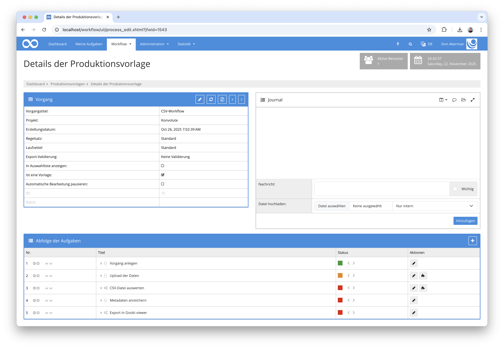
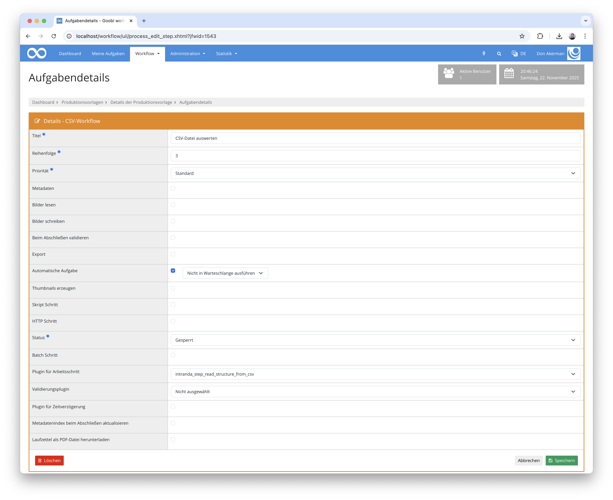

## Einführung
Diese Dokumentation erläutert das Plugin zur Erzeugung von Strukturelementen, die aus einer CSV-Datei ausgelesen werden.

## Installation
Um das Plugin nutzen zu können, müssen folgende Dateien installiert werden:

```bash
/opt/digiverso/goobi/plugins/step/plugin-step-read-structure-from-csv-base.jar
/opt/digiverso/goobi/config/plugin_intranda_step_read_structure_from_csv.xml
```

Nach der Installation des Plugins kann dieses innerhalb des Workflows für die jeweiligen Arbeitsschritte ausgewählt und somit automatisch ausgeführt werden. Ein Workflow könnte dabei beispielhaft wie folgt aussehen:



Für die Verwendung des Plugins muss dieses in einem Arbeitsschritt ausgewählt sein:




## Überblick und Funktionsweise
Wenn der Arbeitsschritt mit dem Plugin gestartet wird, liest das Plugin die Konfiguration aus und such anschließend nach einer CSV-Datei innerhalb des Master-Verzeichnisses. Ist genau eine CSV-Datei vorhanden, wird diese ausgewertet und es werden Strukturelemente für diejenigen Objekte erzeugt, die mit einer Objekt-ID aufgeführt sind. Die Paginierung wird aus den Daten ebenfalls ausgewertet und zusammen mit den Mediendateien den jeweiligen Strukturelementen zugewiesen.

Nach dem Erzeugen der Strukturdaten wird die CSV-Datei in das Import-Verzeichnis des Vorgangs bewegt.

Eine Beispiel-CSV-Datei befindet sich im `docs`-Verzeichnis des Plugins und kann mit der Referenzkonfiguration des Plugins eingelesen werden.


## Konfiguration
Die Konfiguration des Plugins erfolgt in der Datei `plugin_intranda_step_read_structure_from_csv.xml` wie hier aufgezeigt:

{{CONFIG_CONTENT}}

{{CONFIG_DESCRIPTION_PROJECT_STEP}}

Parameter               | Erläuterung
------------------------|------------------------------------
`idColumn`              | Header-Name für die Spalte mit den Objekt-Identifiern
`paginationColumn`      | Header-Name für die Spalte mit Angaben zur Paginierung
`fileColumn`            | Header-Name für die Spalte, die den Dateinamen aufführt
`fileMimeType`          | Vorgabe, welcher Mime-Type für die einzuspielenden Dateien verwendet werden soll
`fileExtension`         | Festlegung des Dateinamenerweiterung für die Mediendateien, die in der METS-Datei eingetragen werden soll
`structureTypes`        | Typ für die Strukturelemente, die erzeugt werden sollen
`column`                | Definition einer Spalte mit Informationen über den zu mappenden Metadatentyp


Attribute für die Spaltendefinition:

Attribut                | Erläuterung
------------------------|------------------------------------
`header`                | Header-Name für die Spalte
`ruleset`               | Definition des Metadatentyps für das anzulegende Metadatum
`person`                | Festlegung, ob es sich um ein normales Metadatum oder eine Person handelt
`separator`             | Falls der Spalteninhalt als Person erzeugt werden soll, kann hier das Trennzeichen festgelegt werden, anhand dessen der Nachname von dem Vornamen getrennt werden soll
