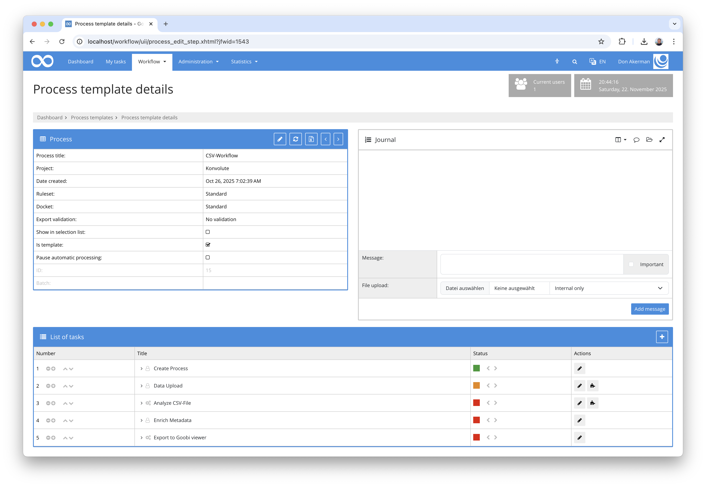
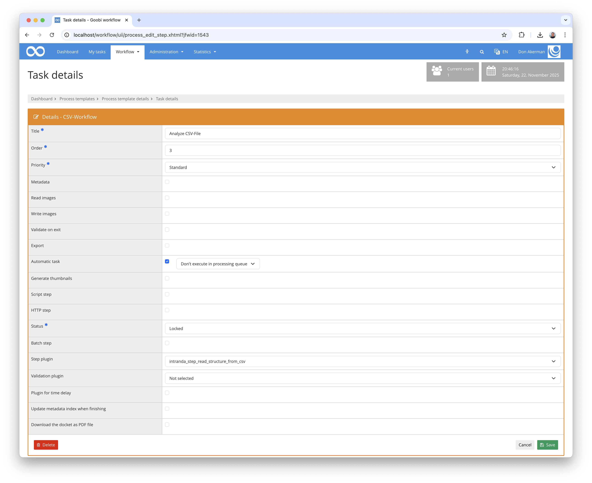
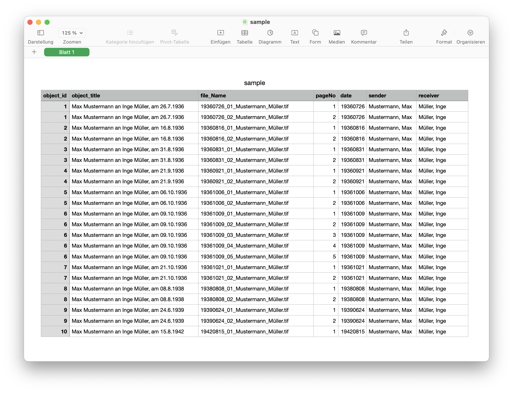

## Introduction
This documentation explains the plugin for generating structural elements that are read from a CSV file.

## Installation
To use the plugin, the following files must be installed:

```bash
/opt/digiverso/goobi/plugins/step/plugin-step-read-structure-from-csv-base.jar
/opt/digiverso/goobi/config/plugin_intranda_step_read_structure_from_csv.xml
```

After installing the plugin, it can be selected within the workflow for the respective work steps and thus executed automatically. An example workflow could look like this:



To use the plugin, it must be selected in a work step.:




## Overview and functionality
When the work step is started with the plugin, the plugin reads the configuration and then searches for a CSV file within the master directory. If exactly one CSV file is found, it is evaluated and structural elements are generated for those objects that are listed with an object ID. The pagination is also evaluated from the data and assigned to the respective structural elements together with the media files.

After the structural data has been generated, the CSV file is moved to the import directory of the process.

A sample CSV file can be found in the `docs` directory of the plugin and can be read in with the reference configuration of the plugin.




## Configuration
The plugin is configured in the file `plugin_intranda_step_read_structure_from_csv.xml` as shown here:

{{CONFIG_CONTENT}}

{{CONFIG_DESCRIPTION_PROJECT_STEP}}

Parameter               | Explanation
------------------------|------------------------------------
`idColumn`              | Header name for the column containing the object identifiers
`paginationColumn`      | Header name for the column containing pagination information
`fileColumn`            | Header name for the column listing the file names
`fileMimeType`          | Specifies which MIME type should be used for the files to be imported
`fileExtension`         | Specifies the file name extension for the media files to be entered in the METS file
`structureTypes`        | Type for the structure elements to be created
`column`                | Definition of a column with information about the metadata type to be mapped


Attributes for column definition:

Attribute               | Explanation
------------------------|------------------------------------
`header`                | Header name for the column
`ruleset`               | Definition of the metadata type for the metadata to be created
`person`                | Determination of whether it is normal metadata or a person
`separator`             | If the column content is to be created as a person, the separator used to separate the surname from the first name can be specified here
